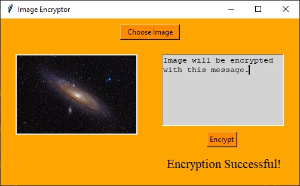

# Steganography
Zaprojektuj i napisz program do obsługi steganografii:
1. Z interfejsem graficznym (może być webowy albo desktopowy)
2. Umożliwiającym "ukrycie" tekstu z użyciem obrazka w dowolnym formacie graficznym (hint: niektóre są prostsze niż inne)
3. Umożliwiającym "odczytanie" tekstu ukrytego w obrazku (zakładamy ten sam schemat i algorytm)
4. Umożliwiającym przed ukryciem tekstu zaszyfrowanie go dowolnym algorytmem (gotowym, nie musi być własny, ale może)
## Usage:
Encrypt text into image - run app from the `encryptor.py`

Decrypt text from image - run app from the `decryptor.py`
## Application appearance:
### Encryptor:

### Decryptor:

## Methods:
You can find methods' docstrings in `encryptor.py` and `decryptor.py`
## Credits:
App was created on the basis of [Section Tutorial](https://www.section.io/engineering-education/steganography-in-python/)